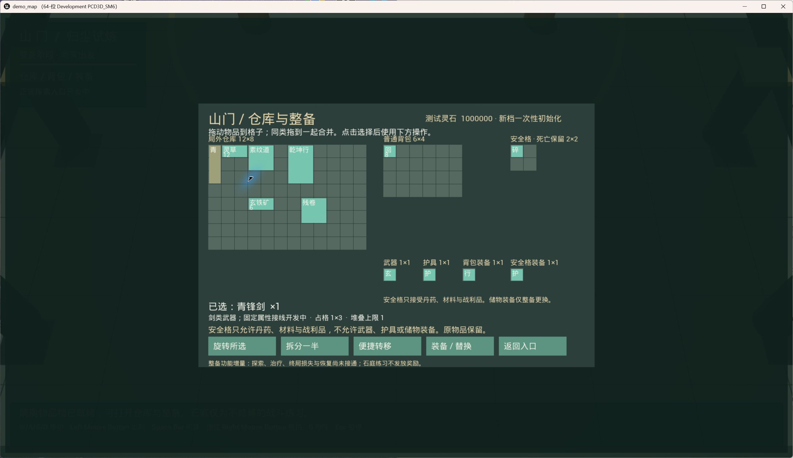
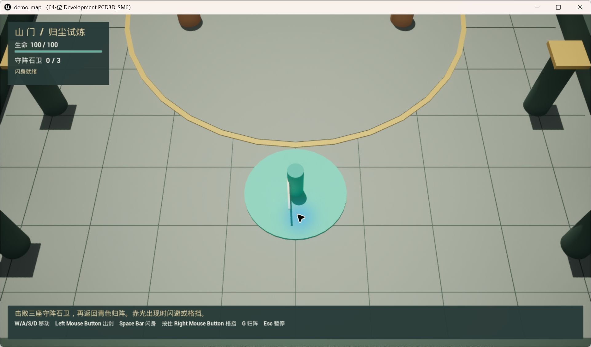

# 山门 Demo2.0 本地运行

当前默认入口为青岚关正式探索，已接持久整备、携带出发、三个相连区域、固定近战／远程／精英守卫、丹药治疗、提前撤离、死亡损失和确认状态续局。搜集增量将宝匣／遗物的已确认随机计划落实为真实来源格，并接领取、新拾取丹药和终局；原携带数量物与背包中未装备武器护具进入同一实际物品图，支持局内整理。最新增量接主动地面丢弃、同一实例拾回和原位置恢复，实际画面与输入仍待人工。完整目标 [单关探索、随机搜集、撤离与死亡循环](../Prompt/Demo20.Expedition.goal.md) 仍在开发：跨来源合并、随机敌人组合和完整真实验收尚未完成。地图和占位美术独立建立，不沿用旧 Demo 材料。

## 启动

先关闭正在运行的 Unreal Editor。双击项目目录中的 `Scripts/Start-Demo20.cmd`，即可使用本机 UE 5.8 启动不经打包的游戏窗口。启动器明确加载 `/Game/Demo20/Maps/L_Demo20_JadePass`，不会落到旧默认 M01 地图。独立石庭练习仍可通过 `-Practice` 选择；不要把练习结果当作正式物品结算。

也可在项目目录运行：

```powershell
./Scripts/Start-Demo20.ps1 -Action Play
```

需要编辑场景或使用 PIE 时：

```powershell
./Scripts/Start-Demo20.ps1 -Action Editor
```

Editor 打开新地图后按 Play。不要直接双击工程后运行旧默认地图来验收 Demo2.0。启动器默认请求 1280×720 窗口，Windows DPI 缩放可能使桌面截图像素尺寸不同。

此入口依赖本机 UE 5.8 和已构建的工程 DLL，不是可以单独分发的 exe。如果刚从 GitHub 获取源码，先运行：

```powershell
./Scripts/Invoke-Shanmen.ps1 -Action BuildBoth -TaskId Demo20.Local
```

新地图和独立调色材质 `Content/Demo20/Materials/M_Demo20_Color.uasset` 一同交付。`GenerateDemo20Expedition.py`、`GenerateDemo20Map.py` 与 `GenerateDemo20Material.py` 仅供首次生成，拒绝覆盖已有资产。青岚关与石庭分别使用正式／练习 GameMode，几何在运行时构建。

## 仓库与整备

入口点击“仓库与整备”，或在整备入口按输入注册表中的背包键，默认 Tab。隔离档经现有唯一物品权威初始化，不读旧 Code A／Code B 库存。新档获得基础装备、少量丹药和一次性 1,000,000 测试灵石；重启不会重发初始物品或货币。

物品目录相对于运行时 `ProjectSavedDir` 为 `Demo20/<档名>/ShanmenItems/Authority`。启动器指定 `-UserDir=Saved/Demo20/User`，因此当前启动方式的默认物品档实际位于工程内 `Saved/Demo20/User/Saved/Demo20/ExpeditionProfile/ShanmenItems/Authority`。不要将它误认为工程根下的 `Saved/Demo20/ExpeditionProfile`，也不要搬移或删除已有档来“修复”路径。

- 点击选择物品；拖到合法格子移动，同类物品拖到一起合并，目标达到堆叠上限时余量留在原来源。
- 下方按钮支持旋转所选物品、拆分一半、仓库与普通背包间便捷转移、装备替换及返回入口。
- 普通背包容量来自已装备行囊：基础 6×4，扩容 8×5；护命匣提供 2×2 安全格。缩容放不下时拒绝并保留全部原状态，先整理内容再更换。
- 储物装备不能放进普通背包或安全格。安全格只允许丹药、材料与普通战利品；不能放入武器、护具或储物装备。
- 所有位置、数量和装备变化在保存确认后刷新。保存失败或状态不确定时不显示成功。

“领取基础补给”仅对应最近一次正式探索死亡。物品权威检查整个库存（包括仓库替代装备），只补确实缺少的青锋剑、道袍、小行囊各 1 件，并在完全缺药时向仓库补 2 枚回春丹；不补灵石。每次死亡最多一次非空补给，重复／重启不重发。已有仓库备用装备时需要自行穿戴；丹药需要自行装入背包。新档与石庭练习不满足领取条件，不能借此刷物品。规则见 [有限补给](BasicSupplyPolicy.md)，真实死亡、补给、再出发证据见 [正式入口 Report](../Report/Demo20.M2.Entry.r0_report.md)。

整备页显示真实携带摘要：普通装备与普通背包物资进入正式探索；安全格、仓库与测试钱包按不同规则保留。缺少已装备武器、护具或普通背包时显示具体出发条件。摘要只读，打开面板不会扣物品或开始一局。点击“出发／继续原局”才提交原子携带启动；有未结算原局时恢复该局，不重新预留。规则见 [携带与 Run 边界](CarryAndRunBoundary.md)。

正式探索已使用装备固定伤害与护甲；普通装备及携带内容死亡损失，安全格装备／已确认内容、仓库和钱包保留。回春丹优先从普通背包的原携带余额或新拾取药扣除，用完后使用已装备护命匣的安全格丹药；仓库、未领取来源或地面中的丹药不能局内使用，石庭练习不消耗持久物品。新拾取与安全格移动走同一物品权威，不能通过整备旁路访问原局；主动从安全格丢到地面的物品失去保护。物品目录见 [整备物品目录](PreparationCatalog.md)。

独立验收档与分辨率可通过正常启动参数指定：

```powershell
./Scripts/Start-Demo20.ps1 -Action Play -ProfileName LocalAcceptance01 -Width 1920 -Height 1080 -TestMoney 1000000
```

档名仅允许字母、数字、下划线和连字符，最多 64 字符；目录始终位于运行时 `ProjectSavedDir/Demo20`。`TestMoney` 仅在该档首次创建时生效，已有档不会增加或重置货币。没有商店买卖系统。不要通过删除存档来模拟安全重试。

## 正式探索与续局

整备后出发，可沿玉色路标向东经过石径、竹林和遗坛。普通近战守卫会接近，远程守卫保持距离并预警落点，精英有较大的攻击范围与较长预警。当前只有固定三只敌人，是探索接线切片，不是最终随机组合或 10–15 分钟的内容量。

入口青色归阵从开局可用。靠近后按交互键，等待约 3 秒；离开或受伤会中断。撤离／死亡页必须显示保存确认才允许返回整备。原局可以 Esc 暂停，选择“保存并返回入口（原局保留）”；再次出发按钮继续该局，不能借整备修改锁定物品。

正常关闭或意外退出后，重开同一档恢复最近确认的 Run、种子、生命、位置、敌人生命／位置和攻击计时，默认暂停等待继续。战斗结果先保存再显示，移动与计时最多回退约 1 秒；撤离读条不恢复，须重新开始，按住的输入不恢复。世界记录位于同档 `Demo20World/<Run>.world`，不保存物品数量。记录缺失、损坏或版本不符时拒绝续局并保留物品档，当前没有自动回退旧备份或玩家修复入口；请保留日志，不删档。

正式探索中按快捷栏第一键（默认数字 `1`）使用回春丹，恢复最多 35 生命，上限 100。满生命、死亡、格挡或出剑／闪身／用药恢复期间拒绝；HUD 显示普通与安全格的可用数量。治疗与扣药经过确认才显示成功，未确认时世界暂停并显示恢复原因，可重试原请求或重启同一档。已经扣除的药品不会在重启后返还，恢复也不会额外扣药；尚待确认时不显示缓存数量为可用。

上述治疗路径已编码并通过原生自动化；代理真实键鼠证据完成满生命拒绝。2026-10-05 启动对应隔离档后，用户反馈“丹药正常使用”，本轮只读核对已闭合日志及数量回执，确认非满生命 93.84 → 100、普通药 8 → 7、持久确认成功。普通治疗人工主路径通过；安全格、冷却／动作／重启边界与失败提示画面仍待补，没有新增治疗成功截图，不代表完整探索完成。

实时验收按 [人工治疗审查说明](ManualMedicineReview.md) 进行，包含隔离档、操作、预期数量和安全注意事项。待人工结果不暂停其他开发；有问题的功能保留版本暂不叠加，其他接线独立推进。当前治疗已收到正常反馈，可按正式来源依赖继续新药使用；不因此改动治疗数值。绕过开发依赖不等于跳过权威或保存校验，完整 Goal 的真实验收要求仍保留。

## 石庭练习与操作

正式探索每个区域出现一只金色宝匣；守卫死亡后出现低矮金色遗物。靠近后按交互键首次搜索约 1 秒，受伤／取消／失焦中断，世界继续运行而玩家停止动作。完成后确认随机计划和实际来源格，再打开局内背包；重开读取当前剩余内容，不重抽或补回已拿走的物品。最新人工步骤见 [领取与局内背包审查](ManualLootReview.md)，原 [来源搜索审查](ManualSourceReview.md) 保留为只读预览阶段历史。

来源页左侧是该宝匣／遗物的实际格子，拖到普通背包或安全格即可领取；同来源同类可合并，满堆余量留在原处。原携带数量物、新物与背包中未装备的武器护具支持移动、旋转、拆分一半和便捷转移，保存确认后刷新。不同来源记录暂不能合并，会显示原因。已穿戴装备与储物装备仍只在整备更换。Tab 可单独查看局内普通背包与安全格，不开放局外仓库。打开背包不会暂停敌人，请在安全处整理；失焦会清除输入、关闭面板并暂停。

原携带剩余量在出发或原局恢复时一次接管到同一物品图，不重新发物；旧待确认用药先恢复，已确认消费不返还。撤离后原物和新物按已确认位置带回，不再从旧账本重复返还；死亡时普通背包内容损失、安全格内容保留，从安全格移出的不再享受保留。未领取的来源物不当作奖励，终局后销毁。将物品拖回已打开的来源只是放回该容器，不是主动地面丢弃。整理过的原药与新药复用既有确认后治疗事务；最新 [统一背包人工步骤](ManualRunInventoryReview.md) 仍待实际操作，旧普通治疗反馈不顺带证明本增量。

局内工具栏第四项为“丢弃所选整堆”；部分丢弃先拆分，再选择需要丢的那堆。合法普通背包／安全格物品经保存确认移到脚下地面行囊，保持原身份、数量和方向。已穿戴装备与储物装备不能通过该入口丢弃。金色行囊有物，灰色已拾空，无碰撞；靠近按交互键直接打开实际地面格子，不重抽掉落。拖回背包或合法安全格，满格／冲突失败时原物留地面，部分堆叠余量留原地。没有拾回的地面物在撤离或死亡时损失，不算带回奖励；下一局不能访问上一局地面容器。重启原局读已确认的位置与当前内容。真实检查见 [地面丢弃与拾回人工审查](ManualGroundDropReview.md)。

点击“石庭练习（不结算）”，靠近石卫，将鼠标指向目标并出剑。赤色范围出现后约 0.8 秒发动攻击；移出范围、闪身或格挡。三座石卫全部击破后，返回入口青色归阵，按交互键撤出。死亡或主动结束后可以返回入口重新开始。这是历史战斗练习，不是探索 Goal 中开局可用的撤离流程。

| 默认输入 | 操作 |
| --- | --- |
| W/A/S/D | 移动 |
| 鼠标位置 | 指向出剑方向 |
| 鼠标左键 | 近距离出剑 |
| Space | 闪身，有恢复时间 |
| 按住鼠标右键 | 格挡，移动减速，不能同时出剑 |
| 1 | 正式探索中使用回春丹；优先普通携带，其次安全格 |
| G | 靠近金色宝匣／守卫遗物搜索；打开地面行囊；在青色归阵处撤出 |
| Tab | 整备入口打开或关闭仓库与背包；正式探索中打开或关闭局内背包 |
| Esc | 搜索中取消；背包中关闭；探索中暂停并可保存原局 |
| Alt+F4 | 关闭本地游戏窗口 |

实际键位读取既有输入注册表，若本机有自定义绑定，以游戏底部提示为准。窗口失焦时会暂停，需要点击继续。

## 当前范围与安全边界

- 玩家与守卫生命值、伤害、防御计算使用现有领域框架。
- 整备与正式探索结果持久保存；石庭仍是临时练习。正式原局恢复不重开生命或敌人；新物领取、局内移动、治疗和终局已接权威，组合的实际窗口验收仍待完成。
- 不修改旧默认地图，不覆盖旧玩家存档。隔离配置与物品权威是不同用途；启动器指定的 UserDir 也会重定位运行时 ProjectSavedDir，物品实际路径见上文。
- 当前完成度与剩余事项见 [阶段状态](ExpeditionStatus.md)，不代表完整游戏完成。
- 没有执行 Cook 或 Package；旧自动开发任务仍保持暂停。

## 开发验证

历史战斗切片已观察入口、HUD、鼠标指向与空击提示、闪身、预警、死亡、重新开局及暂停页面。下面的历史石庭截图不证明新整备 UI 或完整探索流程；各增量新增的实际运行证据与待验收项见相应 Report。持续战斗和完整探索循环仍须真实键鼠验收，不以领域测试替代。

持久整备增量已实际操作移动、旋转、拆分、合并、装备替换、容量变化、缩容拒绝、便捷转移与重启读档。对应候选整备页在实际 1280×720 和 1920×1080 视口下核验；桌面截图受 Windows DPI 影响并非相同像素尺寸。证据与未验收项见 [持久整备 Report](../Report/Demo20.M1.Preparation.r0_report.md) 和 [Development Log](../Log/Demo20.M1.Preparation.r0_log.md)。

历史有限补给增量通过改动驱动 209/0 回归与双构建，携带增量通过 218/0；对应 [补给 Report](../Report/Demo20.M1.Resupply.r0_report.md) 和 [Loadout Report](../Report/Demo20.M1.Loadout.r0_report.md) 保留当时范围，不回改历史结论。正式出发、提前撤离、死亡损失、安全保留、补给与再出发、暂停及重启的历史证据见 [M2 Entry Report](../Report/Demo20.M2.Entry.r0_report.md) 与 [Log](../Log/Demo20.M2.Entry.r0_log.md)。最新治疗、普通／安全格扣药、失败恢复与实际验收范围见 [M2 Medicine Report](../Report/Demo20.M2.Medicine.r0_report.md) 和 [Development Log](../Log/Demo20.M2.Medicine.r0_log.md)。

历史随机来源／首次搜索及持久只读预览通过 11 组改动驱动原生回归：398 Success／0 Fail、398 个去重路径，Editor／Game 双构建通过。对应 [M3 Sources Report](../Report/Demo20.M3.Sources.r0_report.md)、[Development Log](../Log/Demo20.M3.Sources.r0_log.md) 和 [人工步骤](ManualSourceReview.md) 保留当时“不能领取”的范围，不回改历史结论。

来源落实、领取、局内新物网格、治疗和终局的历史增量通过八组改动驱动原生回归：249 Success／0 Fail、249 个去重路径，见 [M3 Loot Report](../Report/Demo20.M3.Loot.r0_report.md) 与 [Development Log](../Log/Demo20.M3.Loot.r0_log.md)。历史只读边界保留在原报告，不代表当前仍限制原物整理。

历史原携带物统一背包通过固定输入双目标构建与八组回归：257 Success／0 Fail、257 个去重路径，结束与十五路径覆盖通过，见 [统一背包 Report](../Report/Demo20.M3.RunInventory.r0_report.md) 与 [Development Log](../Log/Demo20.M3.RunInventory.r0_log.md)。整理、新旧药、搜索／领取 UI、输入、中断、双分辨率和组合终局待 [统一背包人工审查](ManualRunInventoryReview.md) 与 [领取审查](ManualLootReview.md)，不宣布完整 M3 或可玩 Demo 全部通过。

最新地面丢弃与拾回通过固定十九源码 Editor／Game 双构建和八组改动驱动回归：264 Success／0 Fail、264 个去重路径，原生码、结束记录及路径覆盖通过；七项新增用例全部成功。结果见 [地面丢弃 Report](../Report/Demo20.M3.GroundDrop.r0_report.md) 和 [Development Log](../Log/Demo20.M3.GroundDrop.r0_log.md)。本轮不接管窗口、没有新截图，实际显示、输入、重启及安全格丢出后的终局按 [人工步骤](ManualGroundDropReview.md) 检查；原普通丹药反馈不代替此组合验收。





关闭游戏后可运行 `./Scripts/Test-Demo20.ps1`，覆盖 Demo20、CombatCore、BasicSword、VitalityAuthority、VitalityLedger 与 Items 六组。开发阶段使用 `./Scripts/Test-Demo20Grid.ps1 -TaskId Demo20.Development` 从实际改动文件推导全部映射组，包括适用的旧物品与快捷栏回归。脚本检查失败结果、结束记录、原生退出码、路径覆盖并输出 SHA-256。原始证据在 `Saved/FoundationRuns/<TaskId>` 下独立保留。
